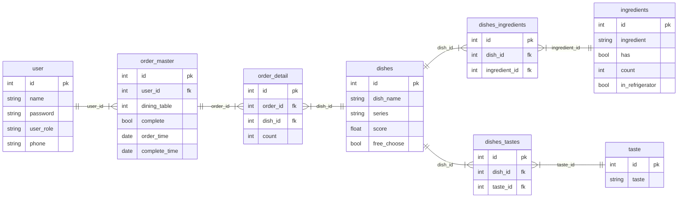

# Entity Relationship Diagram

```mermaid
erDiagram
    direction LR
    user {
        int id  "pk"
        string name  ""
        string password  ""  
        string user_role  ""  
        string phone  ""  
        }

    order_master {
        int id  "pk"  
        int user_id  "fk"  
        int dining_table  ""  
        bool complete  ""  
        date order_time  ""  
        date complete_time  ""  
        }
    
    order_detail {
        int id  "pk"  
        int order_id  "fk"  
        int dish_id  "fk"  
        int count  ""  
        }

    dishes {
        int id  "pk"  
        string dish_name  ""  
        string series  ""  
        float score  ""  
        bool free_choose  ""  
        }

    ingredients {
        int id  "pk"  
        string ingredient  ""  
        bool has  ""  
        int count  ""  
        bool in_refrigerator  ""  
        }

    taste {
        int id  "pk"  
        string taste  ""  
        }

    dishes_ingredients {
        int id  "pk"  
        int dish_id  "fk"  
        int ingredient_id  "fk"  
        }

    dishes_tastes {
        int id  "pk"  
        int dish_id  "fk"  
        int taste_id  "fk"  
        }

    user||--|{order_master:"user_id"
    order_master||--|{order_detail:"order_id"
    order_detail}|--||dishes:"dish_id"

    dishes||--|{dishes_ingredients:"dish_id"
    dishes_ingredients}|--||ingredients:"ingredient_id"

    dishes||--|{dishes_tastes:"dish_id"
    dishes_tastes}|--||taste:"taste_id"
```
